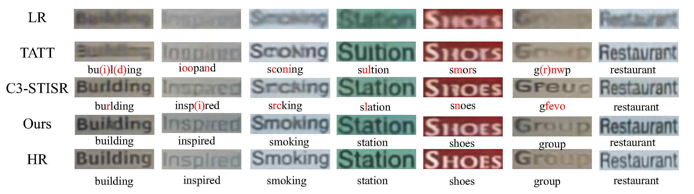
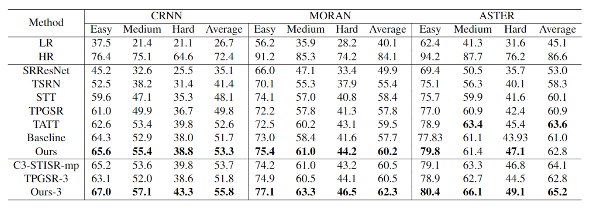
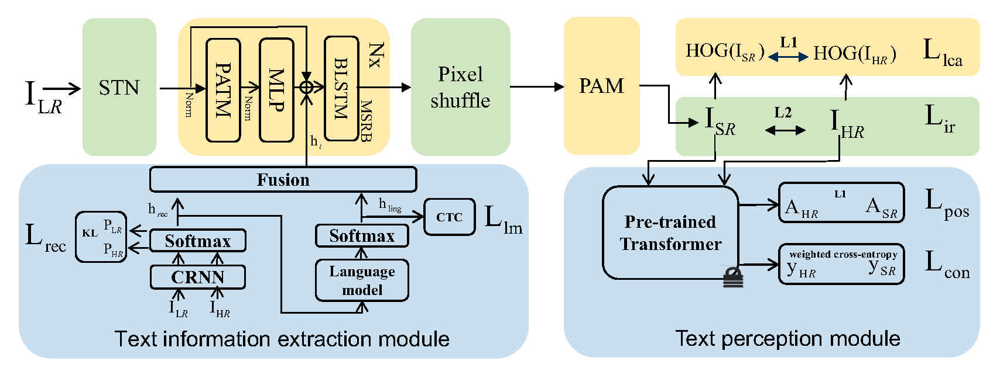

# Robust Text Super-Resolution Network (RTSRN)

This repository contains the source code for the ACM Multimedia 2023 paper "Pixel Adapter: A Graph-Based Post-Processing Approach for Scene Text Image Super-Resolution", [arxiv link](https://arxiv.org/abs/2309.08919).


## 1 Task Introduction

Text Image Super-Resolution, super-resolution reconstruction for text images. The reconstruction results of RTSRN on the TextZoom dataset are as follows:

## 2 Performance Comparison:


Our model compared to other SOTA models on the TextZoom dataset. The values in the table are the accuracy of text recognition, where CRNN, MORAN and ASTER are three different text recognizers.
<br>
The last three lines are a comparison of multi-stage models, and our model has greatly improved performance after multi-stage training.
## 3 Model Introduction

Our model is as follows:


- There are two input paths, one path is the low-quality image $I_{LR}$ entering STN to extract image features; the other path uses CRNN to extract detailed text as text clues input into the main network MSRB for the same low-quality image $I_{LR}$.
- The features obtained by the trunk network are input into the up-sampling module Pixel-shuffle to obtain the super-resolution feature map, and then input into the Pixel-wise attention module (PAM) to optimize the feature map.
- Finally, a CNN is used to obtain the final super-resolution image $I_{SR}$.
## 4 Environment:

Please refer to the following simple steps for installation. 
```
git clone https://github.com/wenyu1009/RTSRN.git
cd RTSRN
conda env create -f environment.yml
conda activate rtsrn
```
## 5 Preparation for running

### Textzoom


[textzoom](https://drive.google.com/drive/folders/1WRVy-fC_KrembPkaI68uqQ9wyaptibMh)
Change TRAIN.train_data_dir to your train data path. Change TRAIN.VAL.val_data_dir to your val data path.


### Download recognizer's pth and code

Download the Aster model from https://github.com/ayumiymk/aster.pytorch, Moran model from https://github.com/Canjie-Luo/MORAN_v2, CRNN model from https://github.com/meijieru/crnn.pytorch.
Change TRAIN.VAL.rec_pretrained in ./configs/super_resolution.yaml to your Aster model path, change TRAIN.VAL.moran_pretrained to your MORAN model path and change TRAIN.VAL.crnn_pretrained to your CRNN model path.
### Download the pth and pkl，which are required in text focus loss
please refer to  [STT](https://github.com/FudanVI/FudanOCR/tree/main/scene-text-telescope)
the path of pkl in weight_ce_loss.py       the path of pth in text_focus_loss.py 
Change these path  for yourself.

### Note

- Setting the learning rate to 0.001 is necessary to achieve better performance.


## 6 Single stage train


```
CUDA_VISIBLE_DEVICES=0 python3 main.py --arch="rtsrn" --test_model="CRNN" --batch_size=48 --STN  --sr_share --gradient  --use_distill --stu_iter=1 --vis_dir='test' --mask --triple_clues --text_focus --lca
```
We can do this:


```
nohup sh train.sh  > log/train_result 2>&1 &
```

## 7 Single stage test


```
CUDA_VISIBLE_DEVICES=1 python3 main.py --arch="rtsrn" --test_model="CRNN" --batch_size=48  --STN  --sr_share --gradient  --use_distill --stu_iter=1 --vis_dir='vis/test' --mask --go_test --resume='ckpt/c3stisr-all-warmup-2ratio' --triple_clues --text_focus --lca --vis
```
We can do this:

```
nohup sh test.sh  > log/test_result 2>&1 &
```
Use this command to test the results of CRNN in the performance comparison table_ The corresponding results can be obtained by replacing the model with ASTER or MORAN.


## 8 Multi-stage train


```
CUDA_VISIBLE_DEVICES=0 python3 main.py --arch="rtsrn" --test_model="CRNN" --batch_size=48 --STN   --gradient  --use_distill --stu_iter=3 --vis_dir='xxx' --mask --triple_clues --text_focus --lca
```

If three-stage training is used, -- stu=3 and -- sr_share are removed <br>


## 9 Multi-stage test

```
CUDA_VISIBLE_DEVICES=0  python3 main.py --arch="rtsrn" --test_model="CRNN" --batch_size=48 --STN  --gradient  --use_distill --stu_iter=3 --vis --vis_dir='vis/xxx' --mask --go_test --resume='ckpt/xxx/' --triple_clues --text_focus --lca
```
After getting the model after the three-stage training, it is consistent with the training, -- stu=3 and -- sr_ share。
This command is in test_ Multi.sh, after use, the performance comparison table can be obtained to summarize the results of CRNN, and test can be replaced_ Model can obtain the results of two other text recognizers.

## 10 Related Works 
· Text Gestalt: Stroke-Aware Scene Text Image Super-Resolution [[Paper]](https://arxiv.org/pdf/2112.08171.pdf) [[Code]](https://github.com/FudanVI/FudanOCR)

· A Text Attention Network for Spatial Deformation Robust Scene Text Image Super-resolution [[Paper]](https://arxiv.org/pdf/2203.09388.pdf) [[Code]](https://github.com/mjq11302010044/TATT)

· Scene Text Telescope: Text-Focused Scene Image Super-Resolution [[Paper]](https://openaccess.thecvf.com/content/CVPR2021/papers/Chen_Scene_Text_Telescope_Text-Focused_Scene_Image_Super-Resolution_CVPR_2021_paper.pdf) [[Code]](https://github.com/FudanVI/FudanOCR)

· Text Prior Guided Scene Text Image Super-resolution [[Paper]](https://arxiv.org/pdf/2106.15368.pdf) [[Code]](https://github.com/mjq11302010044/TPGSR)

· C3-STISR: Scene Text Image Super-resolution with Triple Clues [[Paper]](https://arxiv.org/pdf/2204.14044.pdf) [[Code]](https://github.com/zhaominyiz/C3-STISR)
